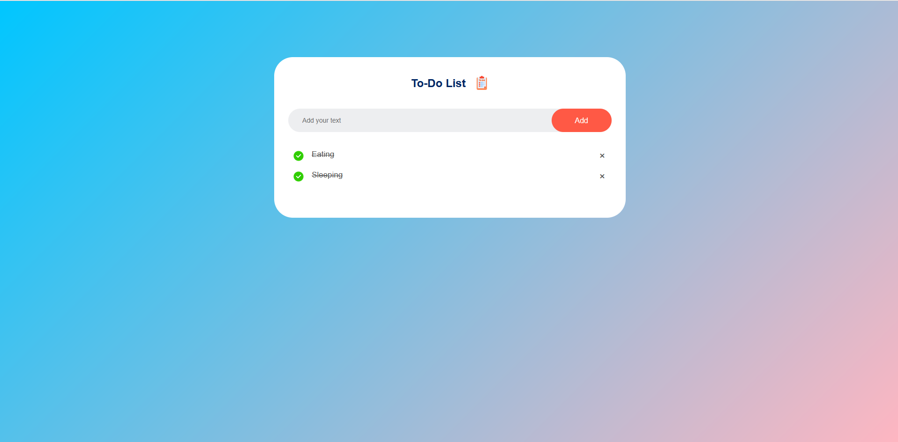
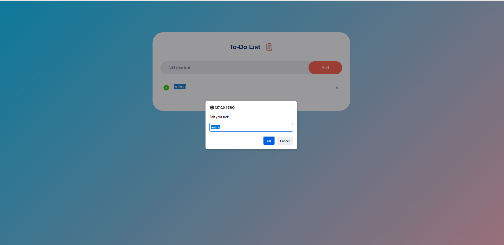

# ✅ TO-DO LIST WEB APP

## 📌 PROJECT TITLE

**TO-DO LIST – SIMPLE TASK MANAGER USING HTML, CSS, AND JAVASCRIPT**

---

## 🎯 OBJECTIVE

To create a **responsive and lightweight to-do list app** that allows users to add, complete, and manage daily tasks directly from their browser. The goal is to provide a clean and intuitive UI for managing tasks effectively.

---

## ⚙️ HOW IT WORKS

### 🧩 Features:

1. **Add Tasks**  
   - Users can type a task in the input field and click the "Add" button to insert it into the list.

2. **Mark Tasks as Completed**  
   - Clicking on a task toggles its completed status by striking through the text and changing its style.

3. **Delete Tasks**  
   - Clicking on the "×" icon removes the task from the list.

4. **Data Persistence** *(optional upgrade)*  
   - Tasks can be saved in `localStorage` to remain even after refreshing the page.

---

## 🖼️ SCREENSHOTS

